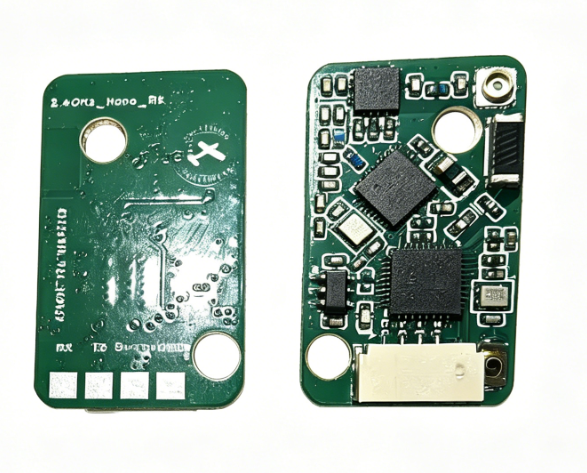
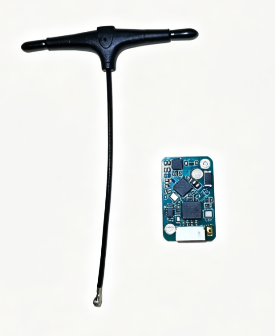

# ELRS协议接收机快速上手指南

## 产品概述

ELRS (ExpressLRS) 是一款开源的高性能无线电控制链路协议，专为FPV无人机和遥控模型设计。本接收机基于ELRS协议开发，提供超低延迟、高可靠性和长距离的无线控制解决方案。



## 产品清单

### 标准包装

| 配件 | 数量 | 说明 |
|------|------|------|
| ELRS 接收机 | 1 | Nano 2.4G  |
| 天线 | 1 | 2.4G  |
| GH1.25 连接线 | 1 | 4Pin 带插头 |
| 热缩管 | 1 | 透明热缩管 |


## 核心优势

- **超低延迟**：端到端延迟可低至5ms
- **长距离传输**：支持数公里控制距离
- **高刷新率**：最高500Hz刷新率
- **抗干扰能力强**：FHSS跳频技术
- **多协议支持**：SBUS、CRSF等多种输出

## 技术参数

### 关键指标

| 参数 | 规格 |
|------|------|
| 工作频率 | 2.4GHz  |
| 发射功率 | 10mW - 250mW可调 |
| 控制延迟 | 5-50ms（取决于配置） |
| 刷新率 | 25Hz - 500Hz |
| 工作电压 | 5V-12V |

### 性能特点

- **接收灵敏度**： -100dBm @ 2.4GHz
- **有效距离**：1km - 10km（视环境和配置）
- **通道数量**：8-16通道
- **工作温度**：-20°C 至 +60°C



## 应用场景

### FPV无人机
- 竞速无人机：超低延迟确保精准操控
- 航拍无人机：长距离传输，稳定可靠
- 练习无人机：经济实惠，易于上手

### 遥控模型
- 遥控飞机：支持多种控制模式
- 遥控车船：抗干扰能力强，适合复杂环境

---

## 快速上手四步走

### 第一步：硬件连接

接收机使用 **GH1.25 插口**，支持5-12V宽电压输入。

**SBUS输出模式：**
```
接收机VCC → 飞控5V
接收机GND → 飞控GND
接收机SBUS → 飞控SBUS_IN
```

**CRSF输出模式：**
```
接收机VCC → 飞控5V
接收机GND → 飞控GND
接收机TX → 飞控RX（指定UART）
```

> **详细说明**：请参考 [硬件接口介绍](硬件接口介绍.md)

---

### 第二步：发射机配置

1. **启用高频头**：进入遥控器模型设置 → SETUP页面 → 开启External RF Mode
2. **协议设置**：Mode设为CRSF，Baudrate设为1.87M
3. **绑定接收机**：
   - 方法一：接收机三连上电进入绑定模式
   - 方法二：通过WiFi配置绑定密码

---

### 第三步：固件升级

**推荐使用Wi-Fi空中升级：**
1. 接收机通电后，按住绑定按钮约3秒进入WiFi热点模式
2. 连接 `ExpressLRS_xxx` 热点（密码：`expresslrs`）
3. 浏览器访问 `http://10.0.0.1`
4. 选择固件版本，点击Flash升级

**串口升级（首次刷写）：**
使用USB-TTL转换器连接接收机进行固件烧录。

> **详细教程**：请参考 [固件刷写](固件刷写.md)

---

### 第四步：飞控配置

根据飞控固件类型进行配置：

| 飞控固件 | 配置要点 |
|----------|----------|
| Betaflight | Receiver Mode设为CRSF/SBUS，配置对应UART为Serial RX |
| ArduPilot | 设置SERIALx_PROTOCOL=23，RC_PROTOCOLS=8 (CRSF) |
| PX4 | 设置RC_SERIAL_PROTO为CRSF或SBUS |

> **详细配置**：请参考 [飞控配置](飞控配置.md)

---

## 常见问题快速排查

| 现象 | 可能原因 | 解决方法 |
|------|----------|----------|
| 接收机不响应 | 未绑定 | 重新绑定 |
| 信号不稳定 | 天线问题 | 检查天线连接 |
| 通道反向 | 通道映射错误 | 调整飞控配置 |
| 失控保护触发 | 信号丢失 | 检查距离和干扰 |

## 重要提示

1. **天线摆放**：远离金属物体和电机，双天线夹角建议90度
2. **飞行前检查**：RSSI值建议> -80dBm
3. **固件版本**：保持发射机和接收机固件版本一致
4. **电压范围**：支持5-12V宽电压输入

---

## 详细文档

- 📖 [硬件接口介绍](硬件接口介绍.md) - 接口定义、引脚说明、技术参数
- 📖 [固件刷写](固件刷写.md) - Wi-Fi升级、串口刷写、故障排除
- 📖 [飞控配置](飞控配置.md) - Betaflight、ArduPilot、PX4配置指南

---

*本文档最后更新日期：2026年5月15日*
