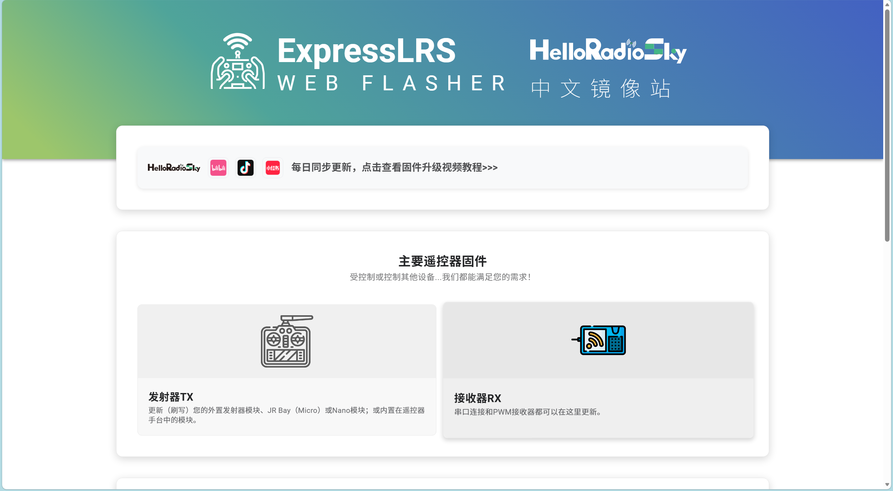
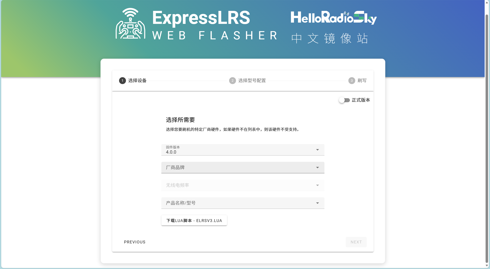

### ELRS 固件刷写指南

本文档基于 ExpressLRS 官方配置工具介绍固件刷写步骤。

#### 准备工作

1. **硬件准备**
   - ELRS 接收机（如使用 ESP8285 芯片的接收机）
   - USB-TTL 转换器（如 CP2102、CH340）
   - 杜邦线若干
   - 稳定的 5-12V 电源（根据产品规格）

2. **软件准备**
   - 访问 [ExpressLRS Configurator](https://elrs.helloradiosky.com/)
   - 或下载桌面版 Configurator

#### 方法一：Wi-Fi 空中升级（推荐）

**适用条件**：接收机已通电且可连接 Wi-Fi

1. **进入绑定模式**
   - 接收机通电20秒左右后，蓝灯快闪
   - 接收机将进入 Wi-Fi 热点模式

2. **连接接收机 Wi-Fi**
   - 在电脑或手机上搜索并连接 `ExpressLRS_xxx` 热点
   - 默认密码：`expresslrs`

3. **访问配置页面**
   - 打开浏览器，访问 `http://10.0.0.1`
   - 进入固件升级页面



4. **选择并刷写固件**
   - 选择对应的固件版本和硬件型号
   - 点击 "Flash" 开始刷写
   - 等待进度条完成（约 1-2 分钟）



5. **验证升级**
   - 刷写完成后接收机会自动重启
   - 检查接收机 LED 指示灯状态

#### 方法二：串口刷写

**适用条件**：首次刷写或 Wi-Fi 升级失败时

1. **硬件连接**
   - 将 USB-TTL 转换器与接收机连接：
     - TTL TX → 接收机 RX
     - TTL RX → 接收机 TX
     - TTL GND → 接收机 GND
     - TTL 5-12V → 接收机 VCC（根据需求）

2. **进入刷机模式**
   - 先按住接收机的绑定按钮
   - 再给接收机通电
   - 保持按钮约 2 秒后松开

3. **打开 Configurator**
   - 访问 [ExpressLRS Configurator](https://elrs.helloradiosky.com/)
   - 选择 "Serial" 连接方式

4. **选择端口和固件**
   - 在 Configurator 中选择正确的串口
   - 选择目标固件版本和型号

5. **开始刷写**
   - 点击 "Flash" 按钮
   - 等待刷写完成
   - 刷写成功后接收机会自动重启

#### 方法三：Betaflight/Cli 刷写

**适用条件**：接收机已连接到飞控

1. **连接飞控**
   - 通过 USB 连接飞控到电脑
   - 打开 Betaflight Configurator

2. **进入 CLI 模式**
   - 进入 "CLI" 选项卡
   - 输入命令查看当前串口配置

3. **刷写命令**
   ```bash
   # 设置串口为 ELRS 刷写模式
   set serialrx_provider = NONE
   save
   
   # 使用 dfu-util 或相关工具刷写
   ```

#### 固件选择指南

| 硬件型号 | 推荐固件 | 备注 |
|----------|----------|------|
| ESP8285 接收机 | `ESP8285_2.4GHz` | 2.4GHz 频段 |
| ESP32 接收机 | `ESP32_2.4GHz` 或 `ESP32_915MHz` | 根据频段选择 |
| Nano 接收机 | `Nano_2.4GHz` | 小型接收机 |

#### 注意事项

1. **电源要求**：刷写过程中确保电源稳定，避免断电
2. **固件匹配**：选择与硬件型号完全匹配的固件
3. **频段选择**：确保固件频段与遥控器频段一致（2.4GHz / 915MHz）
4. **备份配置**：刷写前建议备份当前配置
5. **天线连接**：刷写时建议连接天线，避免信号问题

#### 故障排除

**问题 1：Wi-Fi 热点无法连接**
- 检查接收机供电是否正常
- 确认是否正确进入绑定模式

**问题 2：串口刷写失败**
- 检查串口连接是否正确
- 确认接收机已进入刷机模式
- 尝试更换 USB 线缆或端口

**问题 3：刷写后接收机无响应**
- 检查固件是否与硬件匹配
- 尝试重新刷写或回退到稳定版本

#### 参考资源

- [ExpressLRS 官方文档](https://www.expresslrs.org/)
- [ExpressLRS Configurator](https://elrs.helloradiosky.com/)
