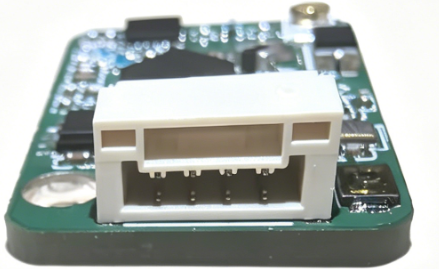
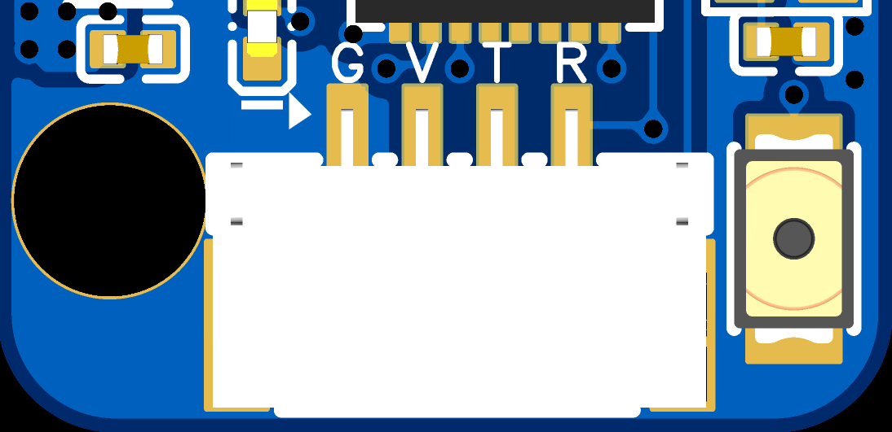

### 硬件接口介绍

#### GH1.25 接口

产品使用 GH1.25 插口，这是一种小型化的板对板连接器，广泛应用于航模接收机和飞控系统中，以其紧凑的尺寸和可靠的连接性能著称。

##### 接口规格

| 参数     | 规格                        |
| -------- | --------------------------- |
| 间距     | 1.25 mm                     |
| 材质     | PA66 塑料外壳，磷铜镀金端子 |
| 额定电流 | 1A / 触点（AWG28线）        |
| 额定电压 | 30V AC/DC                   |
| 工作温度 | -30°C ~ 85°C              |
| 插拔次数 | ≥ 500 次                   |

##### 引脚定义

ELRS 接收机常用的 GH1.25 接口引脚配置：

| 引脚 | 定义     | 说明                          |
| ---- | -------- | ----------------------------- |
| VCC  | 电源正极 | 产品创新支持 5-12V 宽电压输入 |
| GND  | 电源负极 | 接地                          |
| TX   | 发送端   | 接收机输出信号                |
| RX   | 接收端   | 接收机输入信号（用于升级）    |

##### 接口类型

GH1.25 接口常见的引脚数量：

- **3 针**：电源（VCC、GND）+ 单信号输出
- **4 针**：电源（VCC、GND）+ TX、RX 双向通信

##### 物理特性

- **插头类型**：公头（Male）用于接收机端
- **插座类型**：母头（Female）用于飞控或连接线端
- **锁定机制**：卡扣式设计，提供可靠连接

#### ESP8285 芯片

ESP8285 是 Expressif 推出的一款高度集成的 Wi-Fi SoC 芯片，广泛应用于 ELRS (ExpressLRS) 接收机中。

##### 基本参数

| 参数     | 规格                            |
| -------- | ------------------------------- |
| 处理器   | Tensilica L106 32位 RISC 处理器 |
| 主频     | 最高 160 MHz                    |
| 内存     | 80 KB SRAM                      |
| 闪存     | 内置 1 MB Flash                 |
| Wi-Fi    | 802.11 b/g/n，2.4 GHz           |
| 工作电压 | 3.0V - 3.6V（典型 3.3V）        |
| 工作温度 | -40°C ~ 85°C                  |

##### 无线特性

| 特性       | 参数                                                             |
| ---------- | ---------------------------------------------------------------- |
| 无线标准   | IEEE 802.11 b/g/n                                                |
| 频率范围   | 2.4 GHz ~ 2.5 GHz                                                |
| 发射功率   | 802.11b: +20 dBm` `802.11g: +17 dBm` `802.11n: +15 dBm |
| 接收灵敏度 | -98 dBm（802.11b，1 Mbps）                                       |
| 天线       | 支持 PCB 天线或外接天线                                          |

##### 外设接口

| 接口类型 | 数量/说明         |
| -------- | ----------------- |
| GPIO     | 17 个通用 GPIO    |
| UART     | 2 组 UART 接口    |
| SPI      | 1 组 SPI 接口     |
| I2C      | 1 组 I2C 接口     |
| PWM      | 支持多路 PWM 输出 |
| ADC      | 1 路 10 位 ADC    |

##### 功耗参数

| 模式        | 功耗          |
| ----------- | ------------- |
| active (RX) | 约 80-100 mA  |
| active (TX) | 约 120-170 mA |
| Modem-sleep | 约 15 mA      |
| Light-sleep | 约 0.9 mA     |
| Deep-sleep  | 约 10 μA     |

##### 封装信息

- 封装类型：QFN32 (5mm x 5mm)
- 引脚间距：0.5 mm

##### 在 ELRS 中的应用

ESP8285 是 ELRS 接收机的核心芯片，负责：

- 处理射频通信协议
- 解析遥控器信号
- 输出 SBUS/CRSF 等协议信号给飞控
- 支持 Wi-Fi 配置和固件升级

##### 注意事项

1. **供电要求**：确保提供稳定的 5-12V 电源，建议不低于 5V供电
2. **散热设计**：在高功率发射时需要注意散热
3. **天线布局**：天线应远离金属部件和干扰源
4. **固件升级**：可通过 Wi-Fi 或串口进行固件烧录
