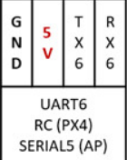
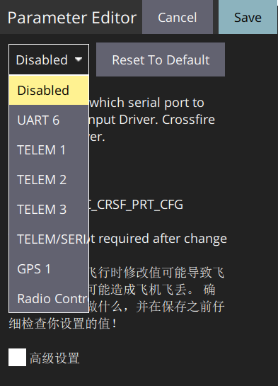

### 飞控配置

# Betaflight配置

1. 打开Betaflight Configurator
2. 进入"Receiver"选项卡
3. 设置"Receiver Mode"为：
   - SBUS输出：选择SBUS
   - CRSF输出：选择CRSF
4. 配置UART端口（如使用CRSF）：
   - 进入"Ports"选项卡
   - 设置对应UART为"Serial RX"
5. 点击"Save and Reboot"

## ArduPilot (APM) 配置

1. 连接飞控并打开Mission Planner
2. 进入"初始设置" → "必要硬件" → "遥控器校准"
3. 设置接收机协议：
   - CRSF输出：设置`SERIALx_PROTOCOL` = 23 (RCIN)
   - SBUS输出：设置`SERIALx_PROTOCOL` = 23 (RCIN)

4. 配置UART端口：
   - 进入"配置/调试" → "全部参数表"
   - 找到对应串口（如SERIAL4）
   - 设置`SERIAL4_PROTOCOL` = 23
   - 设置`SERIAL4_BAUD` = 115（对应115200波特率）

   

5. 设置遥控器协议：
   - 设置`RC_PROTOCOLS` = 8 (CRSF) 或 1 (SBUS)
6. 写入参数并重启飞控
7. 进入"遥控器校准"页面检查通道映射

## PX4 配置

1. 连接飞控并打开QGroundControl
2. 进入"Q"图标 → "载具设置" → "参数"
3. 搜索并设置以下参数：
   - `RC_SERIAL_PORT`：选择连接接收机的串口（如TELEM1、TELEM2）
   - `RC_SERIAL_PROTO`：设置为"CRSF"或"SBUS"
4. 如果使用CRSF协议：
   - `RC_CRSF_PRT_CFG`：配置CRSF端口
   - `RC_CRSF_TEL_EN`：启用/禁用CRSF遥测

   

5. 如果使用SBUS协议：
   - 确保`RC_SBUS_MODE`设置正确
6. 保存参数并重启飞控
7. 进入"遥控器"页面验证通道响应

## 通道映射

| 通道 | 功能             | 建议范围  |
| ---- | ---------------- | --------- |
| CH1  | 副翼（Roll）     | 1000-2000 |
| CH2  | 升降（Pitch）    | 1000-2000 |
| CH3  | 油门（Throttle） | 1000-2000 |
| CH4  | 方向（Yaw）      | 1000-2000 |
| CH5  | 模式切换         | 三档开关  |
| CH6  | 云台控制         | 两档/旋钮 |
