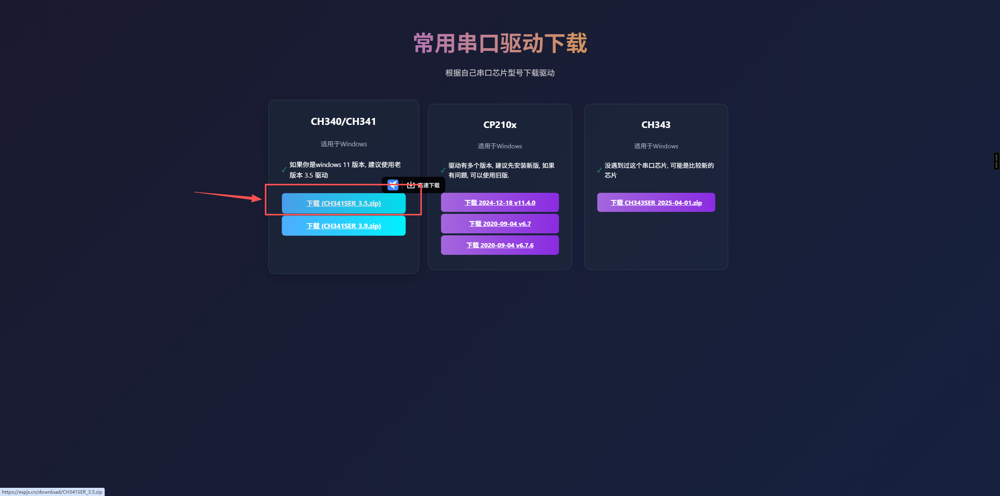
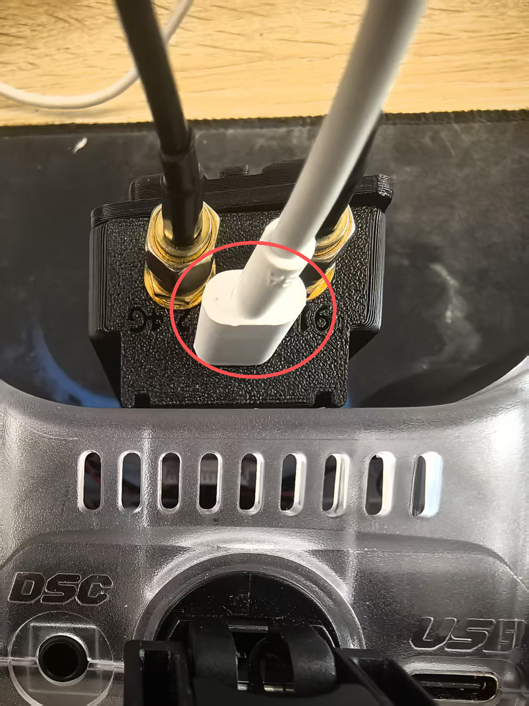
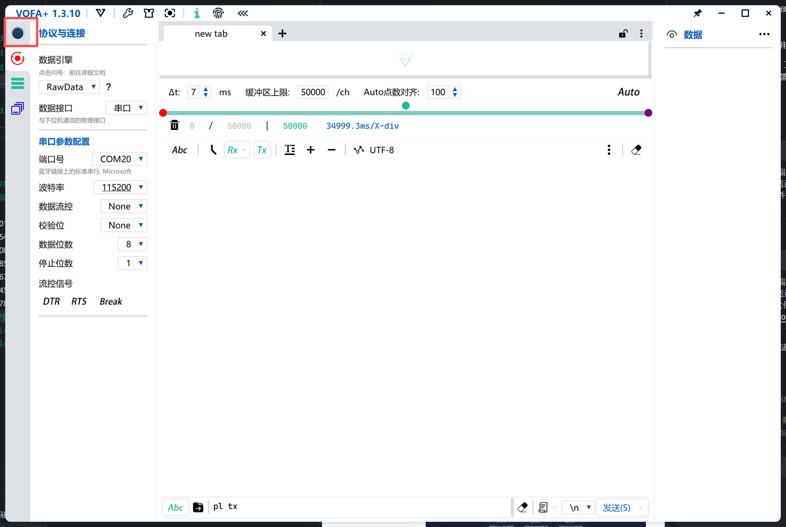
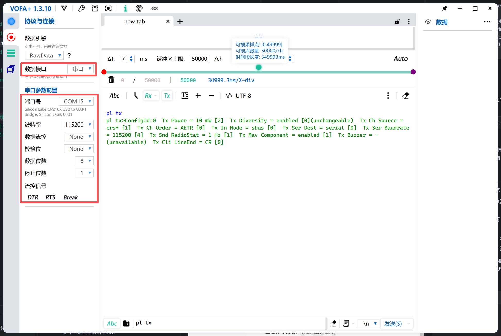
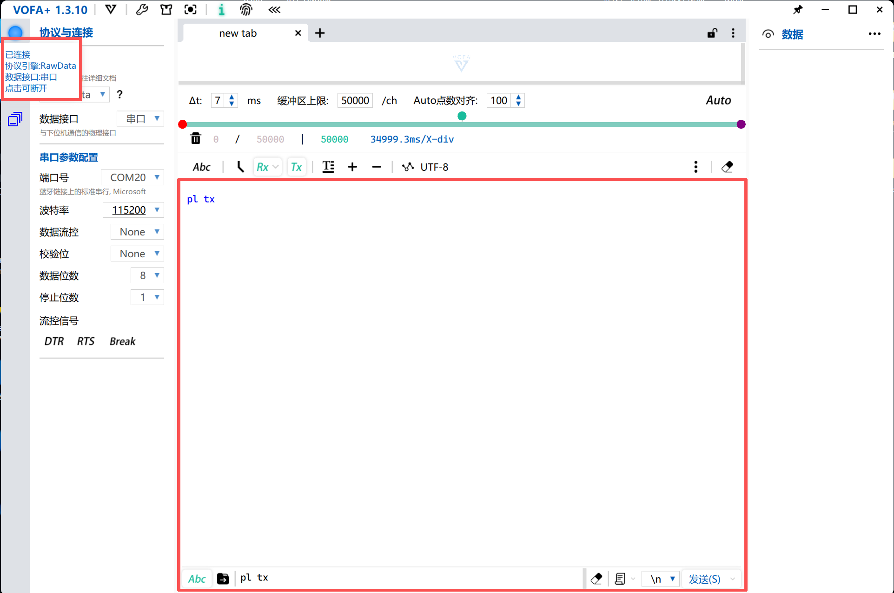
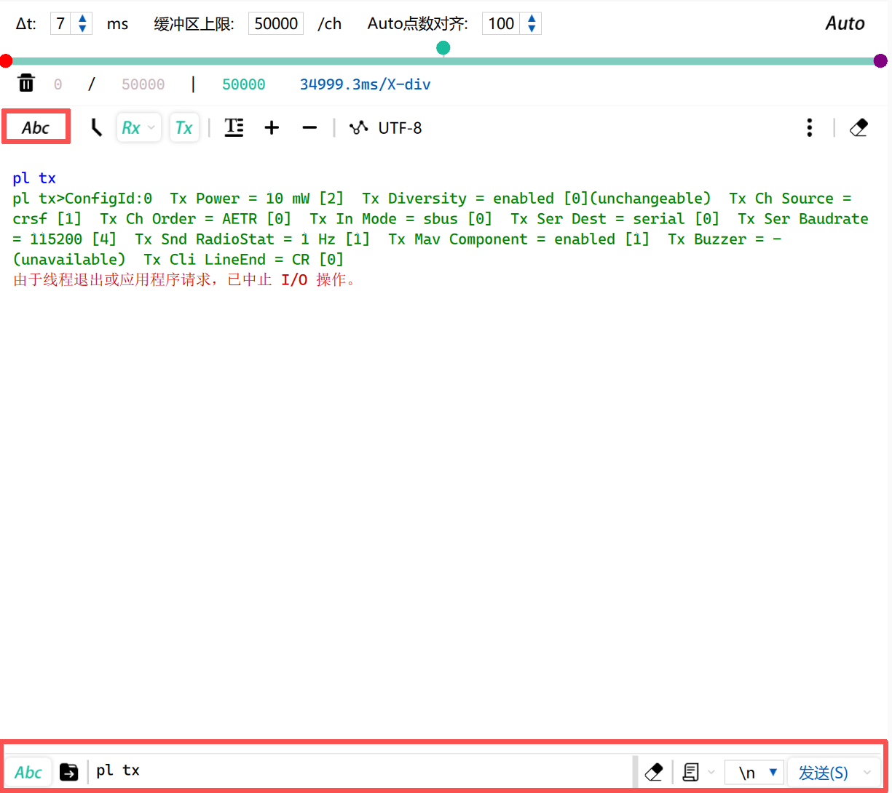
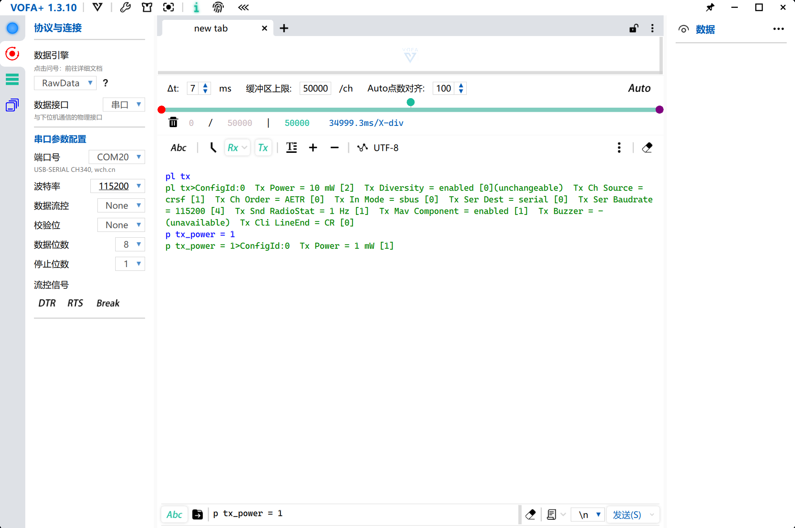
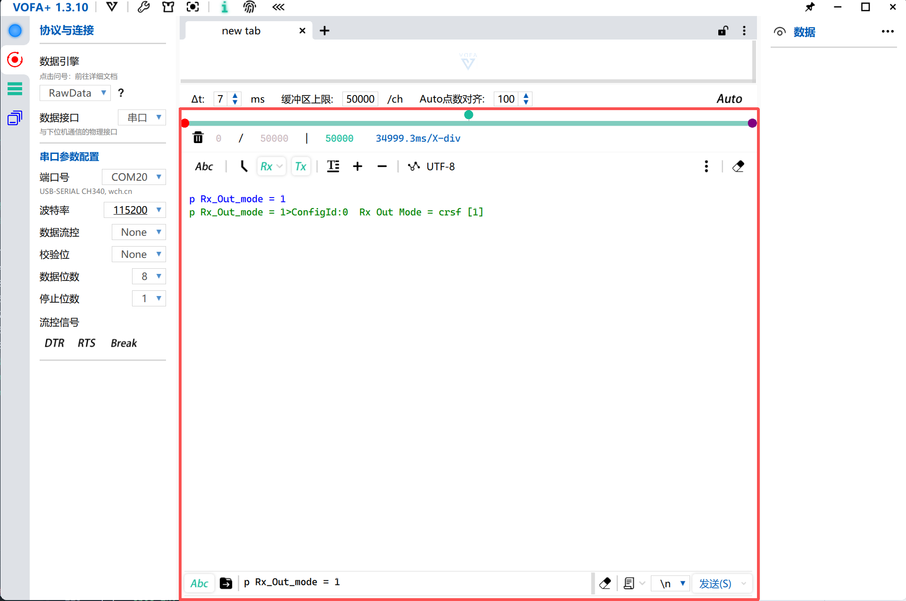
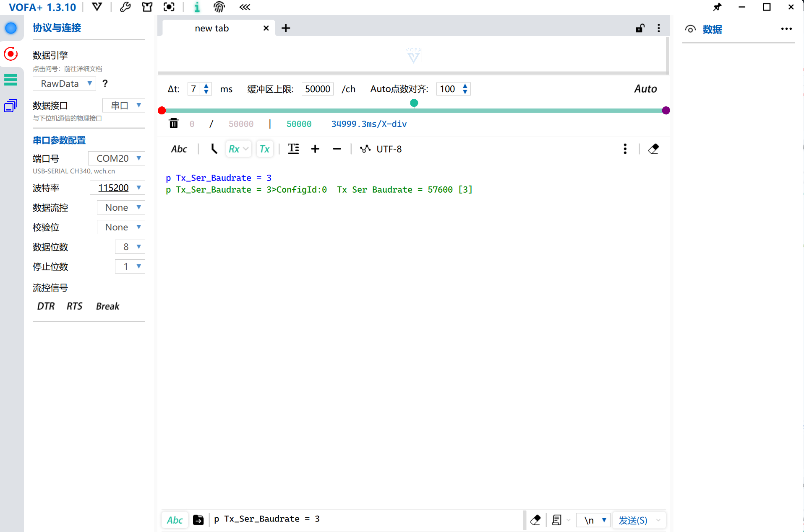

## 1. 终端输入指令修改 mLRS 参数

### 所需材料

| 材料           | 说明                     | 推荐型号  |
| -------------- | ------------------------ | --------- |
| 内置USB-TTL 适配器高频头 | 用于连接 mLRS 模块到电脑 | CH340     |
| type-c 线      | 用于连接适配器和模块     | type-c 线 |
| nano接口遥控器         | 给 mLRS 模块供电         | 遥控器    |
| 串口终端软件   | 用于发送指令             | VOFA+     |

### 准备工作

- **连接方式**：

  1. 将高频头连接遥控器，拆下高频头后盖，找到高频头模块

  

  2. 找到"Bind"按钮，按住它，给遥控器上电，上电后2秒黄灯慢闪可松开按钮（注意:遥控器警告时无法给高频头模块供电，指示灯无法正常亮起！！）

  

)

4. 通过 TYPE-C 端口连接 USB-TTL 适配器，将 USB-TTL 适配器连接到电脑，打开 [VOFA+ 串口终端软件](https://www.vofa.plus/downloads/)

  

点击连接按钮

5. 串口连接参数：端口号选择新出现的端口号，波特率 115200 bps，8 数据位，无校验位，1 停止位（简称 **8N1**）（与天空端对频后，可将天空端上电对天空端远程调参）

* 若未能成功连接高频头模块，在VOFA+串口调试软件中显示可以成功连接但发送指令无法成功执行

> **新手提示**：TX 和 RX 是交叉连接的（适配器 TX → 模块 RX，适配器 RX → 模块 TX），这是串口通信的基本规则。

### 常用指令

- **查看所有参数**：`pl;`
- **查看特定参数**：`p 参数名;`（参数名中的空格用下划线替代，例如 `p tx_power;`）
- **修改参数**：`p 参数名 = 值;`（例如 `p tx_power = 0;`）
- **保存参数**：`pstore;`（参数修改后必须执行此命令才能永久保存）
- **查看命令帮助**：`h;` 或 `help;` 或 `?;`
- **查看版本信息**：`v;`
- **重新加载参数**：`reload;`
- **开始绑定**：`bind;`

*查看TX参数  “pl tx”*

*修改功率至 1mw  “p tx_power = 1”*

*修改天空端输出协议至crsf  “p rx_out_mode = 1”*

*修改高频头波特率至57600 bps  “p ser_baudrate = 3”*

#### Tx 模块参数

| 参数名称                   | 文本值             | 数字值 | 说明                     |
| -------------------------- | ------------------ | ------ | ------------------------ |
| **Tx Power**         | `"min"`          | 0      | 最小发射功率             |
|                      | `"1 mW"`         | 1      | 1 毫瓦                   |
|                      | `"10 mW"`        | 2      | 10 毫瓦                  |
|                      | `"100 mW"`       | 3      | 100 毫瓦                 |
|                      | `"158 mW"`       | 4      | 158 毫瓦                 |
| **Tx Diversity**     | `"enabled"`      | 0      | 分集模式                 |
|                            | `"antenna1"`     | 1      |                          |
|                            | `"antenna2"`     | 2      |                          |
|                            | `"r:en, t:ant1"` | 3      |                          |
|                            | `"r:en, t:ant2"` | 4      |                          |
| **Tx Ch Source**     | `"none"`         | 0      | RC数据输入源             |
|                            | `"crsf"`         | 1      |                          |
|                            | `"in"`           | 2      |                          |
|                            | `"mbridge"`      | 3      |                          |
| **Tx Ch Order**      | `"AETR"`         | 0      | 通道顺序                 |
|                            | `"TAER"`         | 1      |                          |
|                            | `"ETAR"`         | 2      |                          |
| **Tx In Mode**       | `"sbus"`         | 0      | 输入端口协议             |
|                            | `"sbus inv"`     | 1      |                          |
| **Tx Ser Dest**      | `"serial"`       | 0      | 串口数据目标             |
|                            | `"serial2"`      | 1      |                          |
|                            | `"mbridge"`      | 2      |                          |
| **Tx Ser Baudrate**  | `"9600"`         | 0      | 串口波特率               |
|                            | `"19200"`        | 1      |                          |
|                            | `"38400"`        | 2      |                          |
|                            | `"57600"`        | 3      |                          |
|                            | `"115200"`       | 4      |                          |
|                            | `"230400"`       | 5      |                          |
| **Tx Snd RadioStat** | `"off"`          | 0      | 是否发送RADIO_STATUS消息 |
|                            | `"1 Hz"`         | 1      |                          |
| **Tx Mav Component** | `"off"`          | 0      | 是否启用MAVLink参数配置  |
|                            | `"enabled"`      | 1      |                          |
| **Tx Power Sw Ch**   | 通道号             | -      | 功率切换通道             |
| **Tx Buzzer**        | `"off"`          | 0      | 蜂鸣器模式               |
|                            | `"LP"`           | 1      |                          |
|                            | `"rxLQ"`         | 2      |                          |

#### Rx 接收器参数

| 参数名称                   | 文本值                 | 数字值 | 说明               |
| -------------------------- | ---------------------- | ------ | ------------------ |
| **Rx Power**         | `"min"`              | 0      | 最小发射功率       |
|                      | `"1 mW"`             | 1      | 1 毫瓦             |
|                      | `"10 mW"`            | 2      | 10 毫瓦            |
|                      | `"100 mW"`           | 3      | 100 毫瓦           |
|                      | `"158 mW"`           | 4      | 158 毫瓦           |
| **Rx Diversity**     | `"enabled"`          | 0      | 分集模式           |
|                            | `"antenna1"`         | 1      |                    |
|                            | `"antenna2"`         | 2      |                    |
|                            | `"r:en, t:ant1"`     | 3      |                    |
|                            | `"r:en, t:ant2"`     | 4      |                    |
| **Rx Ch Order**      | `"AETR"`             | 0      | RC数据通道顺序     |
|                            | `"TAER"`             | 1      |                    |
|                            | `"ETAR"`             | 2      |                    |
| **Rx Out Mode**      | `"sbus"`             | 0      | 输出端口协议       |
|                            | `"crsf"`             | 1      |                    |
|                            | `"sbus inv"`         | 2      |                    |
| **Rx FailSafe Mode** | `"no sig"`           | 0      | 失效保护模式       |
|                            | `"low thr"`          | 1      |                    |
|                            | `"by cnf"`           | 2      |                    |
|                            | `"low thr cnt"`      | 3      |                    |
|                            | `"ch1ch4 cnt"`       | 4      |                    |
| **Rx Ser Baudrate**  | `"9600"`             | 0      | 串口波特率         |
|                            | `"19200"`            | 1      |                    |
|                            | `"38400"`            | 2      |                    |
|                            | `"57600"`            | 3      |                    |
|                            | `"115200"`           | 4      |                    |
|                            | `"230400"`           | 5      |                    |
| **Rx Ser Link Mode** | `"transp."`          | 0      | 串口链路模式       |
|                            | `"mavlink"`          | 1      |                    |
|                            | `"mavlinkX"`         | 2      |                    |
|                            | `"mspX"`             | 3      |                    |
| **Rx Snd RadioStat** | `"off"`              | 0      | 无线电状态发送模式 |
|                            | `"ardu_1"`           | 1      |                    |
|                            | `"meth_b"`           | 2      |                    |
| **Rx Snd RcChannel** | `"off"`              | 0      | RC通道发送方式     |
|                            | `"rc override"`      | 1      |                    |
|                            | `"rc channels"`      | 2      |                    |
| **Rx Out Rssi Ch**   | `"off"`              | 0      | RSSI输出通道       |
|                            | `"5"` - `"16"`     | 5-16   |                    |
| **Rx Out LQ Ch**     | `"off"`              | 0      | LQ输出通道         |
|                            | `"5"` - `"16"`     | 5-16   |                    |
| **Rx Power Sw Ch**   | 通道号                 | -      | 功率切换通道       |
| **Rx FS Ch1 - Ch16** | `-120%` 到 `+120%` | -      | 失效保护时的通道值 |
