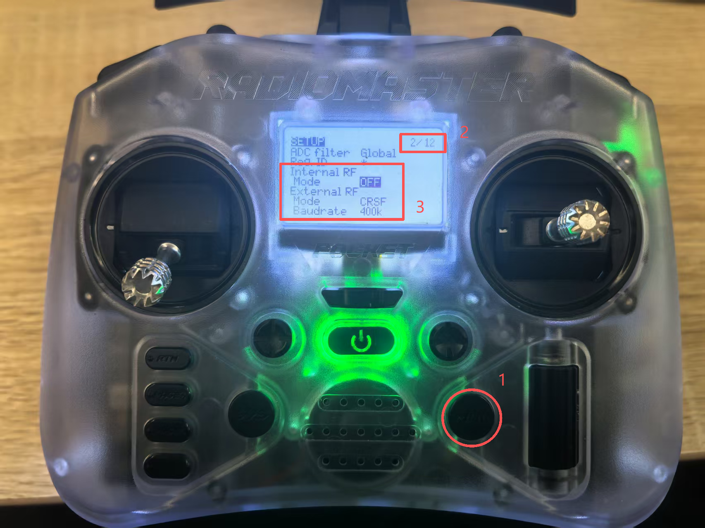
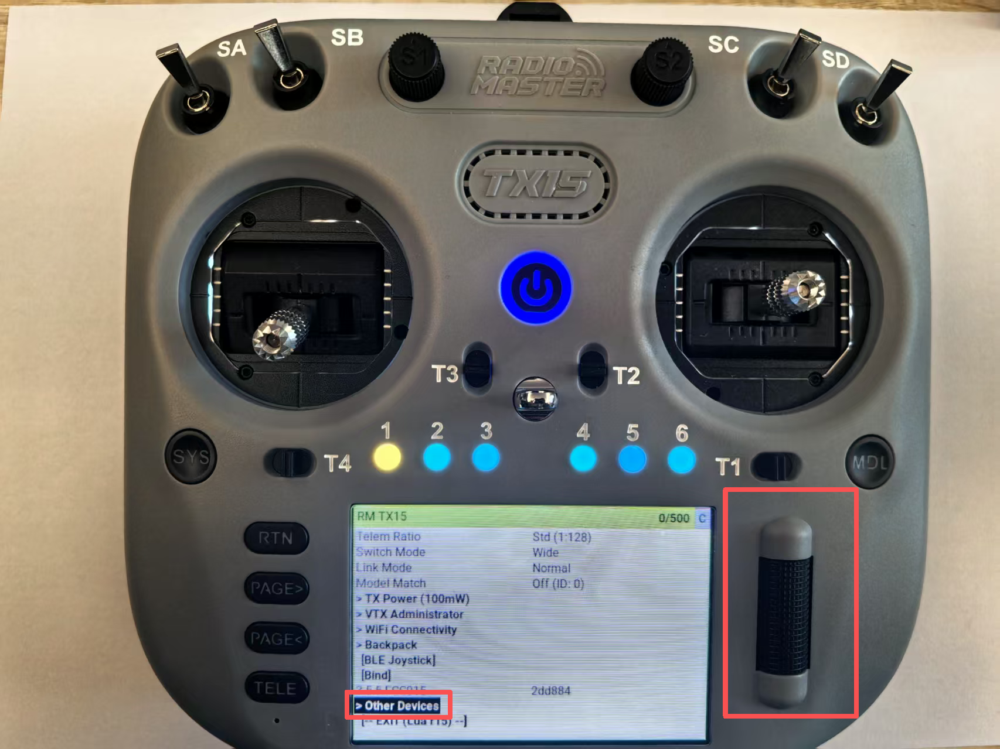
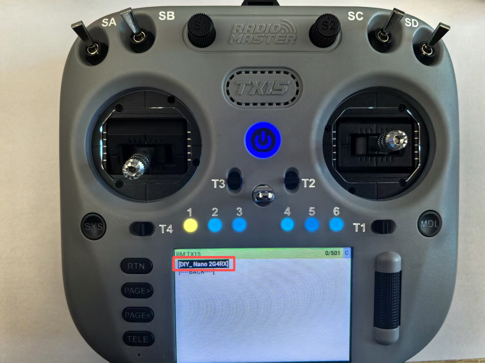
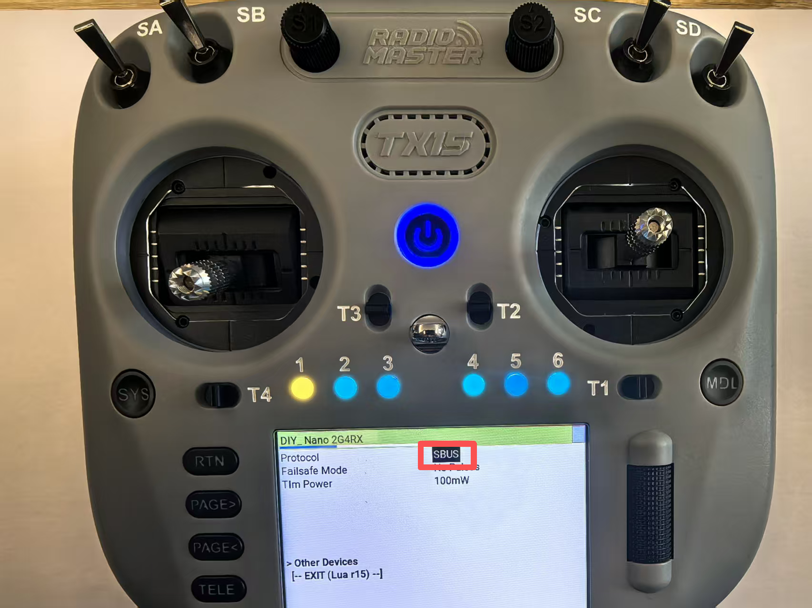

## 2. mLRS 对频方法

在连接飞控之前，需要确保 Tx 模块和接收器已经成功绑定。

### 2.1 自动对频

- 新硬件或工厂重置后，Tx 模块和接收器会自动连接（默认 bind phrase 为 'mlrs.0'）
- 当 Tx 模块和接收器都上电且绑定成功时，LED 会以 1Hz 频率闪烁（通常为绿色）

### 2.2 手动对频

1. 同时按住高频头和接收机的 Bind 按钮
2. 再将它们通电，进入绑定模式
3. 等待绑定完成，LED 绿灯闪烁即连接成功

### 2.3 LED 状态指示

| LED 状态 | 含义 | 排查步骤 |
|----------|------|----------|
| 🟡 黄色 2Hz 闪烁 | 设备未连接 | 检查 Tx/Rx 是否绑定、固件版本是否一致 |
| 🟢 绿色 1Hz 闪烁 | 连接成功 | 正常工作状态 |
| ⚠️ 快速闪烁（>5Hz） | 信号干扰或功率问题 | 更换频段、降低功率或检查天线连接 |
| 🔴 红色常亮 | 硬件故障或启动失败 | 检查电源、重新烧录固件 |

---

## 3. mLRS 连接飞控使用

### 3.1 硬件连接

#### 接收器与飞控连接

1. **MAVLink 串口连接**：

   - 接收器 TX 引脚 → 飞控串口 RX 引脚
   - 接收器 RX 引脚 → 飞控串口 TX 引脚
   - 接收器 GND 引脚 → 飞控 GND 引脚
   - 接收器 VCC 引脚 → 飞控 5V 或 3.3V 引脚（根据接收器规格）
2. **CRSF RC 输出连接**（可选）：

   - 接收器 TX2 引脚 → 飞控另一个串口的 RX 引脚
   - 用于独立的 RC 控制信号
3. **SBUS RC 输出连接**（可选）：

   - 接收器 S 引脚 → 飞控 SBUS 输入引脚
   - 用于传统的 SBUS RC 控制

#### 遥控器与 Tx 模块连接

- 将 mLRS Tx 模块安装到 EdgeTX/OpenTX 遥控器的模块插槽中
- 确保模块与遥控器正确连接

### 3.2 遥控器设置（EdgeTX/OpenTX）

#### CRSF 模式设置（推荐）

1. 进入 `MDL->MODEL SETUP` 菜单
2. 点击翻页键，翻至2/12页
3. 关闭内置高频头，打开外置高频头：
   - **Protocol**：CRSF
   - **Baud Rate**：400K（mLRS 仅支持 400K 波特率）
4. 保存设置

#### SBUS 模式设置（基础模式）

1. 进入 `MDL->MODEL SETUP` 菜单
2. 点击翻页键，翻至2/12页
3. 关闭内置高频头，打开外置高频头：
   - **Protocol**：SBus
4. 保存设置

> **注意**：SBUS 模式下无法使用 Lua 脚本，只能通过 CLI 或 OLED 显示屏配置

#### 3.2.1 更改遥控器输出协议（以TX15为例）

* 接收机对频上遥控器后，进入遥控器高频头界面，滚动滚轮下滑找到“Other Devices”，点击滚轮键，进入其他设备

* 找到接收机，进入接收机界面

* 滚动滚轮下滑找到“Protocol”，点击滚轮键，进行接收机输出协议选择，选择SBUS

### 3.3 mLRS Tx 模块配置

#### CRSF 模式配置

使用 CLI 或 Lua 脚本设置以下参数：

- `Tx Ch Source = crsf`
- `Tx Ser Baudrate = 115200`
- `Tx Ser Dest = serial` 或 `serial2`（不能设置为 mbridge）
- `Tx Snd RadioStat = 1 Hz`

#### SBUS 模式配置

- `Tx Ch Source = in`
- `Tx In Mode = sbus` 或 `sbus inv`（根据信号极性选择）
- `Tx Ser Dest = serial` 或 `serial2`
- `Tx Ser Baudrate = 115200`
- `Tx Snd RadioStat = 1 Hz`

#### 参数说明

- **Tx Ch Source**：通道输入源（crsf/in/mbridge）
- **Tx Ser Baudrate**：串口波特率，应大于链路数据率
- **Tx Ser Dest**：串口数据目标（serial/serial2/mbridge）
- **Tx Snd RadioStat**：发送无线电统计信息频率

### 3.4 mLRS 接收器配置

#### CRSF 模式配置

- `Rx Out Mode = crsf`
- `Rx Ser Baudrate = 57600`（必须匹配飞控串口波特率）
- `Rx Ser Link Mode = mavlinkX`（设置接收器为 MAVLink 模式）
- `Rx Snd RadioStat = ardu_1` 或 `meth_b`
- `Rx Snd RcChannel = rc channels` 或 `rc override`

#### SBUS 模式配置

- `Rx Out Mode = sbus` 或 `sbus inv`（根据飞控要求）
- `Rx Ser Baudrate = 57600`
- `Rx Ser Link Mode = mavlinkX`
- `Rx Snd RadioStat = ardu_1`

#### 参数说明

- **Rx Out Mode**：输出模式（crsf/sbus/sbus inv）
- **Rx Ser Link Mode**：串口链路模式（mavlink/mavlinkX）
- **Rx Snd RadioStat**：发送无线电统计信息格式
- **Rx Snd RcChannel**：RC 通道发送方式

### 3.5 飞控配置（PX4）

#### MAVLink 串口配置

- `MAV_x_BAUD = 57`（57600）
  - 31 Hz 和 50 Hz 模式：57
  - 19 Hz 模式：38（57 也可以使用，只是参数下载较慢）
  - FLRC 模式：230
- `MAV_x_PROTOCOL = 2`（MAVLink v2，重要！不要使用 MAVLink v1）
- `MAV_x_RADIO = 1`（启用无线电统计信息）

> **注意**：'x' 指的是飞控上连接 mLRS 接收器的串口号（如 MAV_1、MAV_2 等）

#### RC 输入配置（如果使用 CRSF RC）

- `RC_PROTOCOLS = 1`（CRSF）
- `RSSI_TYPE = 3`（TelemetryRadioRSSI）
- `SERIALx_BAUD = 400`（400K 波特率）
- `SERIALx_OPTIONS = 0`
- `SERIALx_PROTOCOL = 23`（RCIN）

> **注意**：此串口与 MAVLink 串口不同，PX4 使用 SERIALx 前缀

#### 流速率配置（Stream Rates）

PX4 通常不需要手动配置流速率，因为 PX4 会根据连接的地面站自动调整。但如果需要手动配置，可以使用以下参数：

| 参数           | 50 Hz | 31 Hz | 19 Hz | FLRC |
| -------------- | ----- | ----- | ----- | ---- |
| MAV_x_EXT_STAT | 2     | 2     | 1     | 4    |
| MAV_x_EXTRA1   | 4     | 4     | 4     | 8    |
| MAV_x_EXTRA2   | 4     | 4     | 4     | 8    |
| MAV_x_EXTRA3   | 2     | 2     | 1     | 4    |
| MAV_x_POSITION | 2     | 2     | 2     | 4    |
| MAV_x_RC_CHAN  | 1     | 1     | 1     | 2    |

> **注意**：PX4 使用 MAV_x 前缀而不是 SRy 前缀，'x' 对应 MAVLink 串口号

### 3.6 地面站连接与串口回传

#### 连接方式

1. **通过 mLRS Tx 模块连接**：

   - 使用蓝牙（MatekSys 模块内置 HC-04）
   - 使用 WiFi（ESP 模块）
   - 使用 USB 串口直连
2. **直接连接飞控**：

   - 使用 USB 线连接飞控

#### 串口回传数据格式

mLRS 通过串口输出以下数据：

- **MAVLink 格式遥测数据**：

  - 飞行姿态（姿态角、角速度）
  - GPS 位置信息
  - 电池电压和电流
  - 飞行模式
  - 地速和空速
  - 其他飞行参数
- **CRSF 传感器数据**（28 个传感器）：

  - RSSI 信号强度
  - 链路质量（LQ）
  - 信噪比（SNR）
  - 天线状态
  - 其他遥测数据

#### 导出数据格式

1. **使用地面站软件导出**：

   - Mission Planner：支持多种导出格式
   - QGroundControl：支持日志导出
   - APM Planner 2.0：支持数据导出
2. **数据转换**：

   - MAVLink 数据可以转换为 CSV、KML、GPX 等格式
   - 可以使用第三方工具将 MAVLink 数据转换为 Markdown 格式
3. **实时数据监控**：

   - 地面站软件实时显示飞行数据
   - Yaapu 遥测应用在遥控器上显示数据
   - 可以记录日志供后续分析

#### 地面站软件推荐

- **Windows**：Mission Planner、APM Planner 2.0
- **MacOS**：QGroundControl
- **Linux**：QGroundControl、Mission Planner（通过 Wine）
- **Android**：QGroundControl、DroidPlanner
- **iOS**：QGroundControl

### 3.7 完整配置流程

1. **硬件连接**：

   - 连接接收器到飞控
   - 安装 Tx 模块到遥控器
2. **遥控器配置**：

   - 设置外部模块为 CRSF 协议，400K 波特率
3. **mLRS 配置**：

   - 配置 Tx 模块参数
   - 配置接收器参数
   - 保存配置（pstore;）
4. **飞控配置**：

   - 配置 MAVLink 串口
   - 配置流速率
   - 配置 RC 输入（如果使用）
5. **测试验证**：

   - 验证连接状态（LED 指示）
   - 测试 RC 控制
   - 测试遥测数据传输
   - 进行地面站连接测试
6. **优化调整**：

   - 根据需要调整功率设置
   - 优化流速率配置
   - 配置失效保护