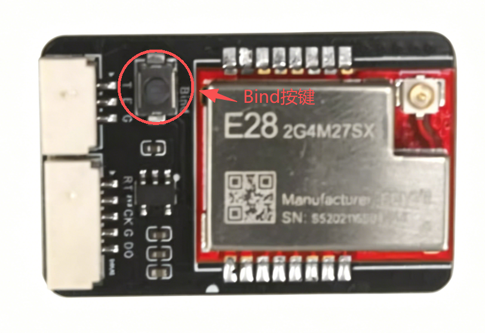
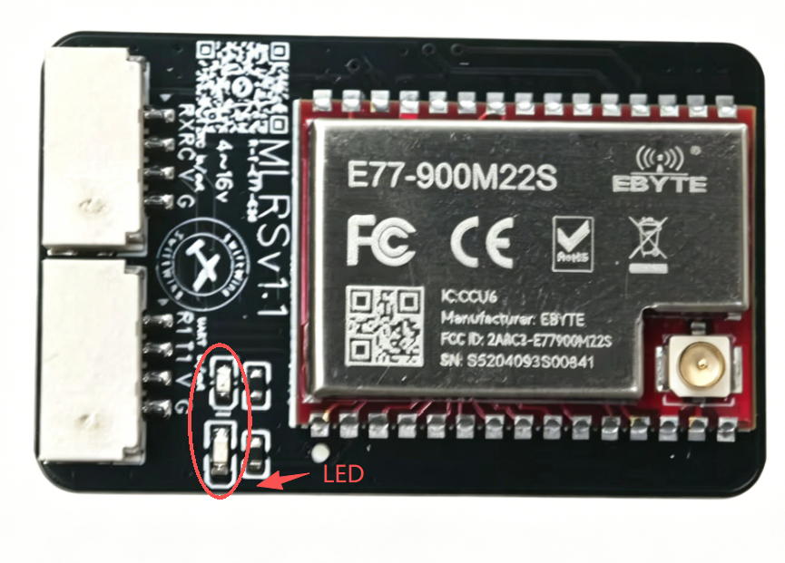
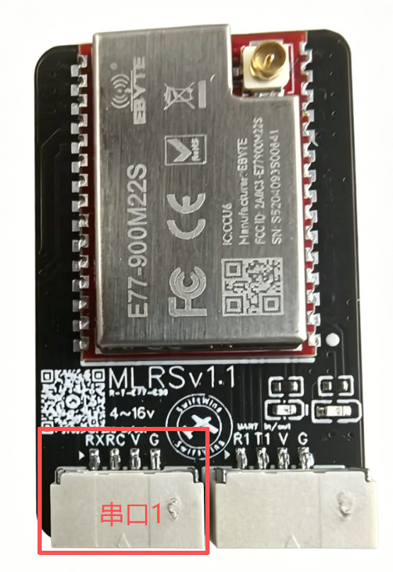
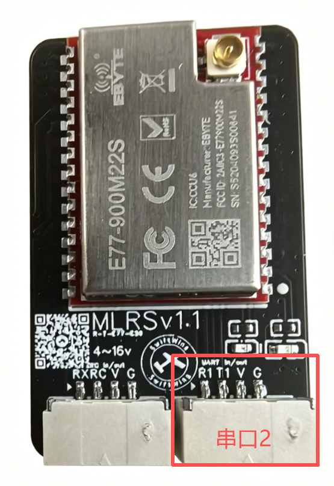
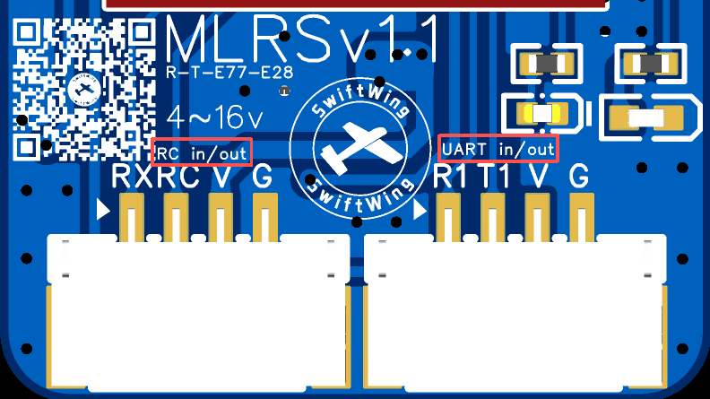
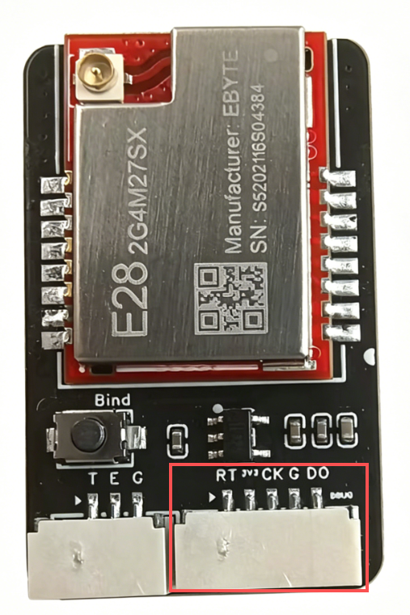
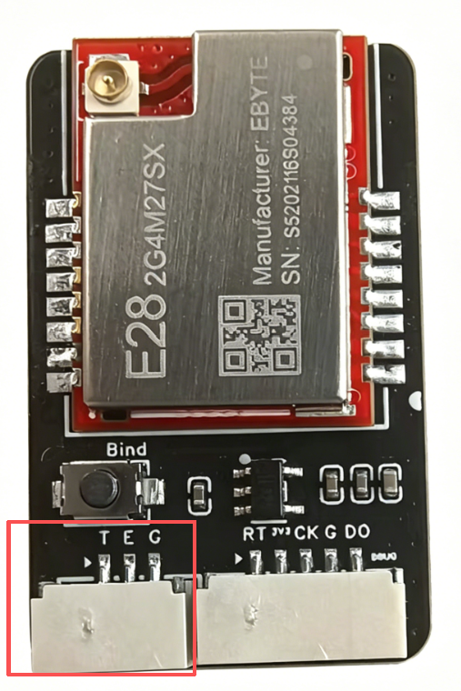
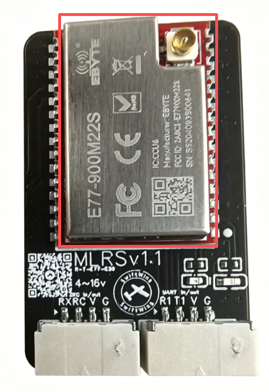
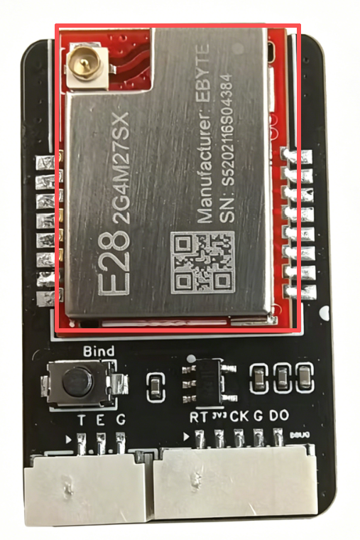

# 硬件功能介绍

本文档详细介绍 mLRS 模块的硬件功能，包括接口说明、射频芯片特性等。

---

## 1. 对频方法

### 1.1 自动对频

- 新硬件或工厂重置后，Tx 模块和接收器会自动连接（默认 bind phrase 为 'mlrs.0'）
- 当 Tx 模块和接收器都上电且绑定成功时，LED 会以 1Hz 频率闪烁（通常为绿色）

### 1.2 手动对频

1. 同时按住高频头和接收机的 Bind 按钮
2. 再将它们通电，进入绑定模式
3. 等待绑定完成，LED 绿灯闪烁即连接成功



### 1.3 LED 状态指示

| LED 状态 | 含义 | 说明 |
|----------|------|------|
| 🟡 黄色 2Hz 闪烁 | 设备未连接 | 每秒闪烁两次，等待绑定 |
| 🟢 绿色 1Hz 闪烁 | 连接成功 | 每秒闪烁一次，正常工作 |
| ⚠️ 快速闪烁（>5Hz） | 信号干扰或功率问题 | 需要检查天线或频段 |



---

## 2. 硬件接口





### 2.1 电源接口

| 引脚 | 信号 | 说明 |
|------|------|------|
| **VCC** | 电源输入 | 5V 或 3.3V（根据模块规格） |
| **GND** | 地线 | 电源负极 |

### 2.2 主串口接口

用于配置模块参数和数据传输。



| 引脚 | 信号 | 说明 |
|------|------|------|
| **T1** | 串口发送 | 数据发送引脚 |
| **R1** | 串口接收 | 数据接收引脚 |
| **RC** | SBUS  | 遥控信号接收 |
|                             | CRSF  | 遥控信号发送 |
| **RX**| SBUS  | 失效         |
|                             | CRSF  | 遥控信号接收 |

> **注意**：串口连接时需要交叉连接（TX→RX，RX→TX）

### 2.3 SWD 调试接口

用于程序下载和调试（型号：BX-GH1.25-5PWT）。



| 引脚 | 信号名称 | 作用 |
|------|----------|------|
| **1** | **SWNRST** | 系统复位信号（低电平有效） |
| **2** | **3.3V** | 为调试器提供 3.3V 电源 |
| **3** | **SWCLK** | 串行调试时钟 |
| **4** | **GND** | 地线 |
| **5** | **SWDIO** | 串行调试数据输入/输出 |

#### 接口用途

1. **程序下载**：将编译好的固件烧录到 MCU 内部 Flash
2. **实时调试**：设置断点、单步执行、查看寄存器和内存
3. **系统复位**：通过 NRST 引脚复位目标系统

#### 连接方式

```
┌─────────────────┐         ┌─────────────────┐
│   调试器/编程器  │         │   mLRS 模块     │
│   (如 J-Link)    │         │   (Cortex-M)    │
├─────────────────┤         ├─────────────────┤
│ 3.3V ───────────┼────────► 引脚1 (3.3V)     │
│ GND  ───────────┼────────► 引脚6 (GND)      │
│ SWCLK───────────┼────────► 引脚3 (SWCLK)    │
│ SWDIO┼──────────┼────────► 引脚5 (SWDIO)    │
│ NRST ───────────┼────────► 引脚2 (SWNRST)   │
└─────────────────┘         └─────────────────┘
```

### 2.4 辅助串口/扩展接口

3针辅助接口（型号：BX-GH1.25-3PWT），用于调试或扩展功能。



| 引脚 | 信号名称 | 作用 |
|------|----------|------|
| **1** | **SWUART_TX** | 辅助串口发送引脚 |
| **2** | **PIN_EXTRA1** | 备用扩展引脚（可自定义用途） |
| **3** | **GND** | 地线 |

#### 接口用途

1. **调试日志输出**：通过 SWUART_TX 输出调试信息
2. **固件更新**：用于特殊的固件升级流程
3. **扩展功能**：PIN_EXTRA1 可作为通用 IO 口使用

> **提示**：此接口主要用于开发调试，普通用户通常不需要使用。

---

## 3. 射频芯片

mLRS 模块支持多种射频芯片，主要包括 E77-900M22S（915MHz）和 E28-2G4M27SX（2.4GHz）。

### 3.1 E77-900M22S 芯片

基于 SX1262 芯片的 LoRa 射频模块，工作在 868/915 MHz 频段。



#### 主要特性

| 参数 | 规格 |
|------|------|
| **工作频率** | 863-870 MHz / 902-928 MHz |
| **发射功率** | 最大 22 dBm（约 158 mW） |
| **接收灵敏度** | -148 dBm（LoRa 模式） |
| **调制方式** | LoRa、FSK、GFSK |
| **数据速率** | 0.6-62.5 kbps（LoRa） |
| **供电电压** | 3.0-3.6V |

#### 适用场景

- **远距离通信**：适合长距离无人机控制（可达数公里）
- **低干扰环境**：915MHz 频段干扰较少
- **合规性**：符合美国 FCC Part 15 标准

### 3.2 E28-2G4M27SX 芯片

基于 SX1280 芯片的 LoRa 射频模块，工作在 2.4 GHz ISM 频段。



#### 主要特性

| 参数 | 规格 |
|------|------|
| **工作频率** | 2400-2483.5 MHz |
| **发射功率** | 最大 27 dBm（约 500 mW） |
| **接收灵敏度** | -136 dBm（FLRC 模式） |
| **调制方式** | LoRa、FLRC、GFSK |
| **数据速率** | 1.2-156.25 kbps（LoRa），最高 2 Mbps（FLRC） |
| **供电电压** | 3.0-3.6V |

#### 适用场景

- **全球通用**：2.4GHz 频段全球免许可
- **高速数据**：支持 FLRC 高速模式
- **短距离高带宽**：适合需要大量遥测数据的场景

### 3.3 双频模块配置

mLRS 支持双频版本，同时使用 E77 和 E28 芯片，实现频率分集：

```
┌─────────────────────────────────────────────────┐
│              mLRS 双频模块                      │
├─────────────────────────────────────────────────┤
│  E77-900M22S        │  E28-2G4M27SX          │
│  (915 MHz)          │  (2.4 GHz)             │
├─────────────────────────────────────────────────┤
│       自动选择最佳频段进行数据传输              │
└─────────────────────────────────────────────────┘
```

#### 双频优势

1. **抗干扰能力强**：即使一个频段受干扰，另一个频段仍可工作
2. **链路可靠性高**：自动选择信号质量最佳的频段
3. **灵活切换**：根据环境自动切换工作频段

#### 配置说明

双频模块的配置与单频模块相同，系统会自动处理频段选择：

```bash
# 查看当前频段配置
p rf_freq;

# 设置频段（自动模式）
p rf_freq = auto;
pstore;
reload;
```

### 3.4 天线选择建议

| 频段 | 天线类型 | 增益建议 |
|------|----------|----------|
| **915 MHz** | 橡胶天线/鞭状天线 | 2-5 dBi |
| **2.4 GHz** | PCB 天线/贴片天线 | 1-3 dBi |

> **注意**：使用双频模块时，需为每个频段连接相应的天线。

---

## 4. 接口功能汇总

### 接口对比表

| 接口名称 | 引脚数 | 主要用途 | 面向用户 |
|----------|--------|----------|----------|
| **电源接口** | 2 | 供电 | 所有用户 |
| **主串口接口** | 2 | 参数配置、数据传输 | 所有用户 |
| **SWD 调试接口** | 6 | 程序下载、调试 | 开发者 |
| **辅助串口接口** | 3 | 调试日志、扩展 | 开发者 |

### 接口连接示意图

```
mLRS 模块接口布局
┌─────────────────────────────────────┐
│  [电源接口]     [主串口接口]        │
│  VCC ── GND    TX ── RX           │
├─────────────────────────────────────┤
│  [SWD调试接口]                     │
│  3.3V SWNRST SWCLK NC SWDIO GND   │
├─────────────────────────────────────┤
│  [辅助串口接口]                     │
│  SWUART_TX PIN_EXTRA1 GND         │
└─────────────────────────────────────┘
```