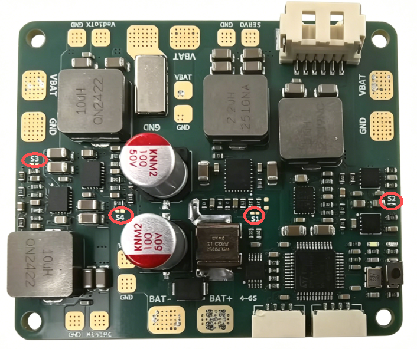
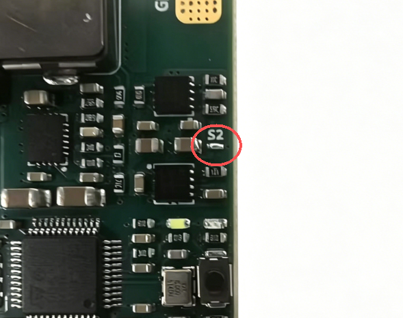

# P1无人机分电板使用说明

## 快速开始

### 1. 硬件连接

#### 电源输入

1. 将电池的正负极连接到分电板的电源输入端（大焊盘）
2. 使用XT60或XT90插头，确保接触良好
3. 电源线建议使用12AWG或更粗的硅胶线

#### 电调连接

- 将电调的电源线连接到分电板的输出端子
- 确保极性正确：红色为正极（+），黑色为负极（-）

#### 飞控连接

- 使用6Pin接口连接飞控的电流计端口
- 接口定义：B+（电池电压）、GND（地）、SMCLK/SMDIO（通信）

### 2. 焊盘配置

根据您的设备需求，配置S1-S4焊盘：

| 焊盘 | 功能       | 焊接  | 断开 |
| ---- | ---------- | ----- | ---- |
| S1   | 舵机电压   | 6.0V  | 5.0V |
| S2   | 协议选择   | CAN   | I2C  |
| S3   | miniPC电压 | 12.0V | 5.0V |
| S4   | 图传电压   | 12.0V | 5.0V |



#### 配置示例



**固定翼配置：**

- S1：断开（5V舵机）或焊接（8.4V高压舵机供电）
- S2：根据飞控协议选择
- S3：断开（如使用5V树莓派供电），短接（如使用12V机载电脑供电）
- S4：根据图数传规格选择

**多旋翼配置：**

- S1：通常断开（5V舵机/云台）
- S2：断开（I2C协议常见）
- S3：根据机载计算机选择
- S4：根据图传规格选择

### 3. 首次上电检查

1. **检查焊接**：确认所有焊点牢固，无虚焊、短路
2. **检查极性**：确认电源输入正负极正确
3. **测量电压**：使用万用表测量各路输出电压是否符合配置
4. **逐步加电**：先不接负载，测量空载电压正常后再连接设备

## 详细接线指南

### 固定翼典型接线

```
电池(3S-6S) ──┬── 分电板电源输入
              │
              ├── 电调1 ── 电机1
              ├── 电调2 ── 电机2
              │   ...
              │
              ├── 5V/6V输出 ── 舵机（副翼、升降、方向、油门）
              ├── 5V/12V输出 ── 图传
              ├── 5V/12V输出 ── 迷你PC（可选）
              │
              └── 6Pin接口 ── 飞控电流计
```

### 多旋翼典型接线

```
电池(3S-6S) ──┬── 分电板电源输入
              │
              ├── 电调1 ── 电机1
              ├── 电调2 ── 电机2
              ├── 电调3 ── 电机3
              ├── 电调4 ── 电机4
              │   ...（6轴/8轴以此类推）
              │
              ├── 5V输出 ── 飞控供电
              ├── 5V/12V输出 ── 图传
              ├── 5V/12V输出 ── 云台/相机
              │
              └── 6Pin接口 ── 飞控电流计
```

## 常见问题

### Q1: 上电后无输出

**排查步骤：**

1. 检查电源输入是否有电压
2. 检查保险丝是否熔断
3. 检查焊盘配置是否正确
4. 检查是否有短路情况

### Q2: 输出电压不正确

**排查步骤：**

1. 检查对应焊盘S1-S4的配置
2. 重新焊接或断开焊盘
3. 测量焊盘两端是否真正连通/断开

### Q3: 电流计读数异常

**排查步骤：**

1. 检查6Pin接口连接是否正确
2. 检查飞控电流计参数设置
3. 校准飞控电流计

### Q4: 分电板发热严重

**排查步骤：**

1. 检查总电流是否超过120A
2. 检查是否有短路或过载
3. 改善散热条件（增加风扇或散热片）
4. 检查电源线规格是否足够

## 维护与保养

### 日常检查

- 定期检查焊点是否松动
- 检查接口是否有氧化
- 清理灰尘和杂物

### 存储建议

- 存放在干燥环境中
- 避免高温和潮湿
- 长期不用时做好防尘保护

## 安全注意事项

1. **防短路**：接线时避免工具或线材造成短路
2. **防反接**：务必确认电源正负极正确
3. **防过载**：不要超过120A额定电流
4. **防过热**：大电流使用时注意散热
5. **防静电**：焊接时使用防静电措施

## 技术规格速查

| 项目       | 规格                  |
| ---------- | --------------------- |
| 输入电压   | 11.1V - 25.2V (3S-6S) |
| 最大电流   | 120A                  |
| 舵机输出   | 5V/8.4V 可选          |
| 迷你PC输出 | 5V/12V 可选           |
| 图传输出   | 5V/12V 可选           |
| 安装孔距   | M3标准孔              |
| 工作温度   | -20°C ~ 85°C        |

## 故障排除流程图

```
设备不工作
    │
    ├── 检查电源输入 ── 无电压 → 检查电池和连线
    │
    ├── 检查输出电压 ── 异常 → 检查焊盘配置
    │
    ├── 检查电流计 ── 异常 → 检查6Pin接口和飞控设置
    │
    └── 检查发热情况 ── 过热 → 检查负载和散热
```

## 联系支持

如有问题，请联系：

- 淘宝店铺：[SwiftWing](https://item.taobao.com/item.htm?id=975458285619)
- 技术支持：见产品包装内的联系方式
