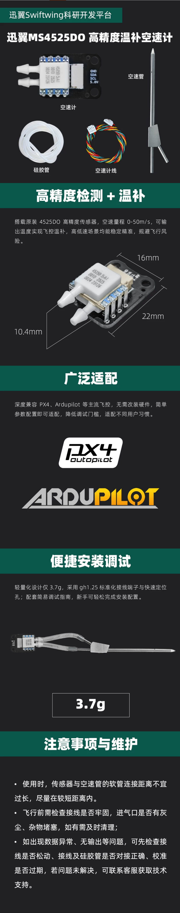

# 迅翼MS4525DO空速计

[淘宝链接](https://item.taobao.com/item.htm?id=989546519846&mi_id=00009W49-tyracAFdkHplODAaWZFU5KPqpV_CCeCfwJ2iMU&spm=a21xtw.29178619.0.0)

| 参数类别 | 具体参数                     |
| -------- | ---------------------------- |
| 核心传感器 | 4525DO高精度空速传感器       |
| 测量范围 | 0-50m/s                      |
| 适配飞控 | PX4、APM固件飞控             |
| 工作电压 | 5V（飞控直插供电）           |
| 工作温度 | -10℃-85℃                     |
| 产品重量 | 3.7±0.1g（仅模块，不含硅胶管和金属管） |
| 输出信号 | I2C                          |
| 模块尺寸 | 22* 16* 10.4                             |

